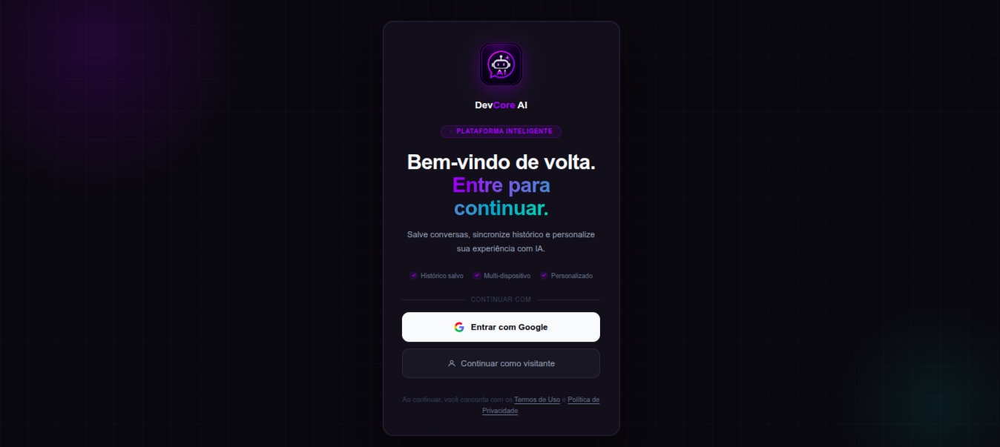
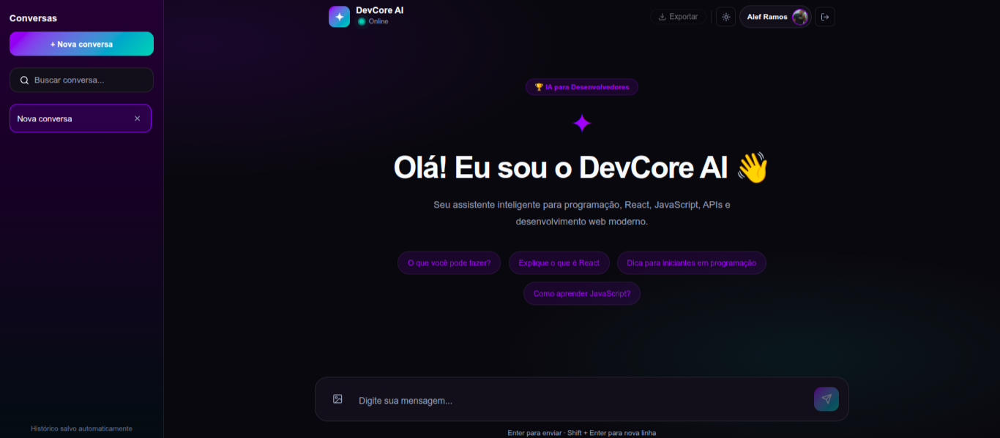

<div align="center">

# 🤖 AI Chatbot with React + OpenRouter

### Desenvolvido por Alef Ramos

Chatbot inteligente desenvolvido com React + IA, focado em experiência moderna, performance e auxílio para desenvolvedores.

<br/>


<br/>
<br/>

</div>

---

## 📌 Sobre o projeto

O **AI Chatbot with React + OpenRouter** é uma aplicação web moderna desenvolvida para fornecer uma experiência conversacional inteligente através de IA.

A aplicação permite que usuários conversem em tempo real com um assistente virtual, recebam respostas formatadas e interajam através de uma interface rápida, moderna e responsiva.

Este projeto foi construído aplicando conceitos utilizados em aplicações reais:

- Componentização
- Hooks personalizados
- Consumo de APIs
- Persistência de dados
- Arquitetura escalável
- UX/UI moderna
- Boas práticas

---

## ✨ Funcionalidades

✅ Conversas em tempo real  
✅ Integração com OpenRouter API  
✅ Histórico de mensagens  
✅ Conversas salvas automaticamente  
✅ Auto Scroll  
✅ Indicador de digitação  
✅ Renderização Markdown  
✅ Destaque de sintaxe para códigos  
✅ Blocos de código formatados  
✅ Interface responsiva  
✅ Persistência com LocalStorage  
✅ Layout moderno

---

<h2>📸 Preview</h2>

<p align="center">

  
  
</p>

---

## 🛠 Tecnologias utilizadas

### Front-end

- React 19
- Vite
- JavaScript
- Styled Components

### Bibliotecas

- React Markdown
- Rehype Highlight
- Remark GFM
- Axios

### API

- OpenRouter API

### Ferramentas

- Git
- GitHub
- Biome
- VSCode

---

## 📂 Estrutura do projeto

```bash
src
├── assets
├── components
│   ├── Header
│   ├── ChatWindow
│   ├── ChatInput
│   ├── MessageBubble
│   ├── MarkdownMessage
│   └── TypingDots
│
├── hooks
│   └── useChat.js
│
├── services
│   └── api.js
│
├── styles
│   └── GlobalStyles.js
│
├── utils
│   └── getTime.js
│
├── App.jsx
└── main.jsx
```

---

## ⚙️ Instalação

Clone o repositório:

```bash
git clone https://github.com/AllefRamos14/ai-chatbot.git
```

Entre na pasta:

```bash
cd ai-chatbot
```

Instale as dependências:

```bash
npm install
```

Execute:

```bash
npm run dev
```

---

## 🔑 Variáveis de ambiente

Crie um arquivo `.env`:

```env
VITE_API_URL=http://localhost:3001
```

> ⚠️ As chaves da API ficam somente no backend por segurança.

---

## 🔗 Backend

👉 https://github.com/AllefRamos14/ai-chatbot-backend

---

## 🚀 Melhorias futuras

- [ ] Upload de imagens
- [ ] Exportar conversas
- [ ] Sistema de múltiplos chats
- [ ] Streaming de respostas
- [ ] Temas Dark/Light
- [ ] Login de usuários
- [ ] Banco de dados
- [ ] Compartilhamento de conversa

---

## 👨‍💻 Desenvolvedor

Desenvolvido por **Alef Ramos**

[](https://github.com/AllefRamos14)

[](https://linkedin.com/in/allef-ramos)

[](https://portfolio-dev-alef-ramos.vercel.app)

---

<div align="center">

### ⭐ Se gostou do projeto, deixe uma estrela

</div>
